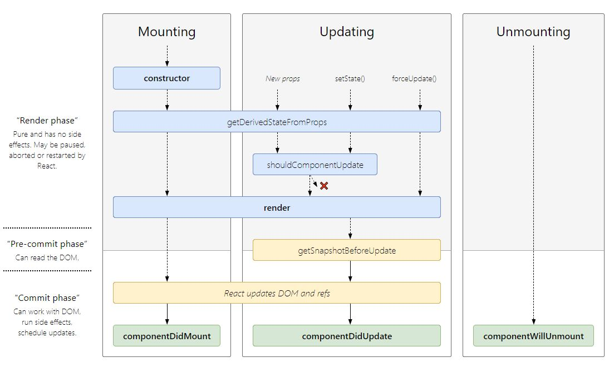

## React.js

#### Component

There are 2 ways of creating a component in react, function and class.

###### Function Component

```js
const MyComponent = () => (
    <div></div>
)
```

###### Class Component

```js
class MyComponent extends React.Component {
    render() {
        return <div></div>
    }
}
```

###### Function vs Class

The canonical answer to the difference between function and class component has been `class component provides more features such as states`. However this is no longer true after `Hooks` are introduced.

In 2019, the difference between function and class component is that `function component captures the rendered values`. For example if you pass a prop into a `setTimeout`, in a class component if the prop changed, the new value will be used when the setTimeout callback runs. In a function component, the original value of the prop will be used.

###### Pure Component

A pure component is a component that always renders the same result given the same props and state, creating these correctly will give you a performance boost in some cases.

`React.PureComponent` for class component, this also provides a `shouldComponentUpdate()` lifecycle with a shallow prop and state comparision.

`React.memo` for function component.

**Note**: Pure component should not have complex data structure or it may produce false-negatives for deeper differences.

###### State

A state is an object built into react component, it stores data that belongs to that component. When state chagnes, the component responds by re-rendering.

Initializing state

```js
class MyComponent extends React.Component {
    constructor (props) {
        super(props)
        this.state = {...} // use this.state to initialize state
    }
    render(...)
}
```

State is meant to be immutable, to update state `setState({ key: value })` should be used, changes made directly with `this.state[key] = value` will cause untracked state change and cause problems. 

`this.state` is not immediately updated when `setState()` is called, instead react waits until all components call `setState()` in their event handlers before starting to re-render, this prevents unnecessary re-renders. And updating this.state without re-render will cause consistency issue between `props` and `state`.

###### Props

`props` (short for _properties_) are a component's __configuration__, it's passed down from parent component that represents info about the component.

`props` are __immutable__.

How to receive props

```js
// function component
const MyComponent = (props) => (...)
// class component
class MyComponent extends React.Component {
    constructor(props) {
        super(props) // must call super
        ...
    }
    render() {...}
}
```

_Default_ `props` can be setup with `React.defaultProps`

```js
MyComponent.defaultProps = {
    key: defaultValue
}
```

Typechecking for `props` can be done with `React.propTypes`, this requires a separate npm package called `prop-types`

```js
MyComponent.propTypes = {
    key: PropTypes.string.isRequired // example
}
```

More detail on how to use `prop-types` can be found [here](https://www.npmjs.com/package/prop-types).

###### State vs Props

`props` and `state` are both plain JavaScript objects, and both triggers re-render.

The difference between them is `props` is passed down from parent component and is `immutable`. `state` is managed within the component itself and while _should_ but is not `immutable`.

###### Refs

`refs` provides a way of accessing DOM nodes or React elements created in the render method.

Creating Refs

```js
class MyComponent extends React.Component {
    constructor(props) {
        super(props)
        this.myRef = React.createRef()
    }
    render() {
        return <div ref={this.myRef} />
    }
}
```

Accessing Refs

```js
const node = this.myRef.current // a reference to the node becomes accessible at the `current` attribute of the ref.
```

__Note:__ ref cannot be used on function components because they don't have instances.

Pre-React 16.3 should use [callback refs](https://reactjs.org/docs/refs-and-the-dom.html#callback-refs) instead.

###### Lifecycle

Each component has several "lifecycle methods" that can be overriden to run code at particular times in the process.

- Mounting
  
  - constructor()
  
  - static getDerivedStateFromProps()
  
  - render() (only required lifecycle method)
  
  - componentDidMount()
  
  __Note__: `componentWillMount` but is deprecated and should be avoided.

- Updating
  
  - static getDerivedStateFromProps()
  
  - shouldComponentUpdate() (only for PureComponent)
  
  - getSnapshotBeforeUpdate()
  
  - componentDidUpdate()
  
  __Note__: `componentWillUpdate()` and `componentWillReceiveProps` are deprecated and should be avoided.

- Unmounting
  
  - componentWIllUnmount()

- Error Handling
  
  - static getDerivedStateFromError()
  
  - componentDidCatch()

Image of lifecycle



#### Hooks

A new addition in React 16.8, this allows you to use state and other React features in function component.

Basic Usage

```js
const MyComponent = () => {
    // creates a state called 'count'
    const [count, setCount] = useState(0) // init value of 0
    function increment() {
        setCount(count + 1) // use setCount (the hook) to change value of count
    }
}
```

Effect Hook

```js
// similar to componentDidMount and componentDidUpdate
useEffect(() => {
    // update the document title
    document.title = count
    return () => { // clean up previous effect
        document.title = 'done'
    }
})
```

The _Effect Hook_, `useEffect` tells React the component needs to do something after render. It unifies `componentDidMount`, `componentDidUpdate`, and `componentWillUnmount` in React classes into a single API. By default, `useEffect` will run on every render, but you probably don't want to re-render if state has not changed, this can be achieved by skipping effects.

Skipping Effects

```js
useEffect(() => {
    document.title = count
}, [count]) // Only re-run the effect if count changes
```

#### React Router

The standard routing library for React.

Getting started, wrap `<App />` in index.js with `router` component.

```js
ReactDOM.render(
    <BrowserRouter> // can also be other routers such as HashRouter
        <App />
    </BrowserRouter>,
    ...
)
```

Using `<Switch>` to wrap component to render on specific path.

```js
<Switch>
    <Route path="/link"> // render this when link is "/link"
        <MyComponent />
    </Route>
</Switch>
```

Use `<NavLink>` component to tell react router to redirect to a path.

```js
<NavLink to="/link">Link</NavLink> // this redirects to "/link"
```

Use `<Redirect>` to navigate to a new location.

When `<Redirect>` is rendered, it will navigate to the location specified, this is how to redirect programmatically in React.

```js
<Redirect to="/link" />
```

#### JSX

Note on .jsx:

    According to `create-react-app`, `.jsx` format was useful before `babel`, in current time `.jsx` is not necessary anymore and not recommanded by `create-react-app`. Most editors can be configured to use JSX-capable syntax scheme for `.js` file.

_The distinction between `.js` and `.jsx` files was useful before Babel, but it’s not that useful anymore._

[reference][1]

[1]: https://github.com/facebook/create-react-app/issues/87#issuecomment-234627904 "reference"
